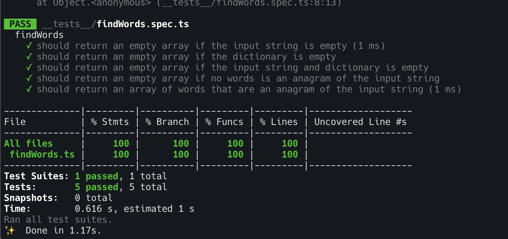
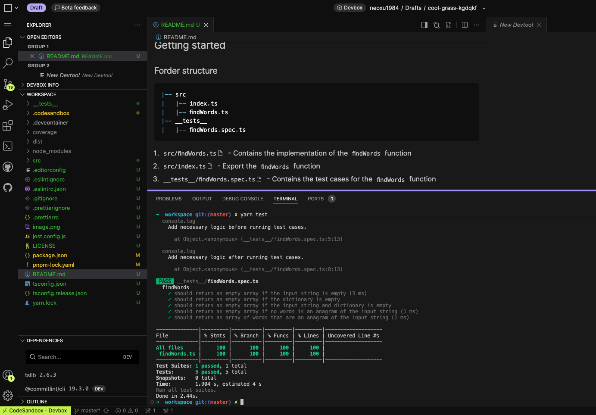

# weekend-health

[](https://codesandbox.io/s/github/neoskx/weekend-health)

## Algorithm

`function findWords(inputString: string, dictionary:string[]): string[]`

- Use a hashmap(object) to store the char count of the `inputString`
- Iterate over the `dictionary` array and check if the char count of the word is less than or equal to the char count of the `inputString`

### Complexity Analysis

- Time Complexity: `O(N * K)` where `N` is the length of the `dictionary` array and `K` is the unique chars of the `inputString`
- Space Complexity: `O(K)` where `K` is the unique chars of the `inputString`

## Test cases

Added test cases for the `findWords` function:

1. should return an empty array if the input string is empty - edage case
2. should return an empty array if the dictionary is empty - edage case
3. should return an empty array if the input string and dictionary is empty - edage case
4. should return an empty array if no words is an anagram of the input string
5. should return an array of words that are an anagram of the input string
   - Add test case listed in the provided doc
   - Add test case for repeated chars in the input string
   - Add test case for complex input string

If have more time, I will add more test cases to cover all the edge cases
1. Add test cases that have more complex input string including multiple lower case chars
2. Add test cases that have more complex dictionary including multiple lower case chars, upper case chars, and special chars
3. Enhance the validation of the input string and dictionary



## Getting started
### Forder structure
```
|-- src
|   |-- index.ts
|   |-- findWords.ts
|-- __tests__
|   |-- findWords.spec.ts
```
1. `src/findWords.ts` - Contains the implementation of the `findWords` function
2. `src/index.ts` - Export the `findWords` function
3. `__tests__/findWords.spec.ts` - Contains the test cases for the `findWords` function

### How to run test cases

#### In CodeSandbox
If you have codesandbox account, you can run the test cases in codesandbox

- Click on the `Open in CodeSandbox` badge
- Click on the `Fork` button
- Click on the `Convert to Devbox ` button
- Run `npm test` or `yarn test` in the terminal


#### In local

- Clone the repository
- Run `npm install` or `yarn install`
- Run `npm test` or `yarn test`
